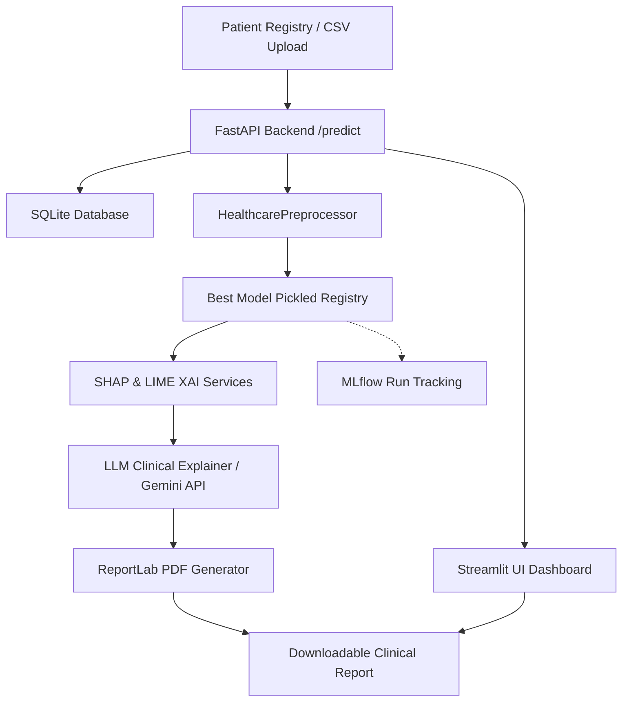

# CareRisk AI - Healthcare AI Risk Prediction Platform

CareRisk AI is a production-quality, end-to-end clinical decision support platform designed to predict 30-day hospital readmission risk for diabetic patients using the **Diabetes 130-US hospitals dataset**. 

The platform leverages explainable Machine Learning classifiers (such as XGBoost, Random Forest, Calibrated SVM) paired with generative LLM clinical reasoning (Gemini API) to provide care teams with both quantitative risk probabilities and structured, plain-English patient discharge recommendations.

---

## Key Features

- **Automated Data Processing**: Cleaning, missing value imputation, deceased/hospice patient exclusion, multi-dimensional clinical feature engineering (ICD-9 mapping, disease severity, visit frequency), scaling, and feature selection.
- **Auto-Selected Machine Learning Pipeline**: Evaluates and compares Logistic Regression, Decision Trees, Random Forests, XGBoost, Gradient Boosting, Calibrated SVM, and KNN. Autoselects the top-performing model (highest validation F1-score) for registry deployment.
- **Dual XAI Explainer**: Combines **SHAP (global/local)** and **LIME (local)** tabular explainers to calculate feature-level impacts on predictions.
- **LLM Clinical Reasoning**: Generates clinical interpretations and discharge checklists based on patient demographics, prediction features, and clinical guidelines. (Gracefully falls back to a rule-based expert system if `GEMINI_API_KEY` is not provided).
- **Interactive Streamlit Dashboard**: Includes Home KPIs, single-patient prediction forms, CSV batch uploads, interactive cohort EDA, SHAP global summary pages, and API documentation.
- **Audit Logging & Database Tracking**: Retains complete history of predictions, file uploads, and trained models in SQLite.
- **Professional PDF Export**: Generates printable and downloadable clinical summary PDFs containing demographics, risk probability, SHAP factors, and recommendations.
- **Production-Ready Architecture**: Built with FastAPI backend REST endpoints, full typing, PEP8 adherence, pytest suite, and multi-container Docker support.

---

## System Architecture



---

## Tech Stack

- **Python**: 3.12 (Core)
- **Backend API**: FastAPI, Pydantic, Uvicorn
- **Frontend UI**: Streamlit, Plotly
- **Machine Learning**: Scikit-Learn, XGBoost
- **Explainability (XAI)**: SHAP, LIME
- **Clinical AI**: Google GenAI SDK (Gemini-2.5-Flash)
- **Reporting**: ReportLab (PDF Engine)
- **Database**: SQLite3
- **Model Tracking**: MLflow
- **Testing**: Pytest, HTTPX

---

## Directory Structure

```
Healthcare-AI-Risk-Prediction/
├── app/
│   ├── backend/                # FastAPI main, routing, and Pydantic schemas
│   ├── frontend/               # Streamlit application pages and CSS
│   ├── models/                 # Preprocessing pipeline and training scripts
│   ├── services/               # DB operations, SHAP/LIME, LLM integration, PDF generator
│   ├── utils/                  # Yaml loader, dataset downloader, loggers
│   └── config/                 # Global configuration file
├── data/                       # Raw and preprocessed patient files
├── logs/                       # Application logs
├── reports/                    # Preprocessing reports and generated PDFs
├── tests/                      # Pytest unit and integration test suite
├── Dockerfile                  # Slim Docker build specification
├── docker-compose.yml          # Local multi-service environment setup
├── requirements.txt            # Package dependencies
└── README.md
```

---

## Installation & Setup

### Option 1: Docker (Recommended - One-Command Setup)

1. Clone this repository:
   ```bash
   git clone https://github.com/yourusername/Healthcare-AI-Risk-Prediction.git
   cd Healthcare-AI-Risk-Prediction
   ```

2. Setup your Gemini API Key in the environment (optional):
   *Windows (PowerShell):*
   ```powershell
   $env:GEMINI_API_KEY="your_api_key_here"
   ```
   *Linux/macOS:*
   ```bash
   export GEMINI_API_KEY="your_api_key_here"
   ```

3. Spin up the environment using Docker Compose:
   ```bash
   docker-compose up --build
   ```

4. Access the platforms:
   - **Streamlit Dashboard**: `http://localhost:8501`
   - **FastAPI Documentation**: `http://localhost:8000/docs`

---

### Option 2: Local Manual Setup

1. Create a Python 3.12 virtual environment and activate it:
   ```bash
   python -m venv venv
   source venv/bin/activate  # On Windows: .\venv\Scripts\Activate.ps1
   ```

2. Install dependencies:
   ```bash
   pip install -r requirements.txt
   ```

3. Download the Diabetes 130-US hospitals dataset:
   ```bash
   python -m app.utils.data_downloader
   ```

4. Execute the training and auto-tuning pipeline to generate the first model:
   ```bash
   python -m app.models.pipeline
   ```

5. Start the FastAPI backend:
   ```bash
   uvicorn app.backend.main:app --reload --port 8000
   ```

6. In a new terminal window, launch the Streamlit frontend:
   ```bash
   streamlit run app/frontend/main.py --server.port 8501
   ```

---

## API Endpoints

- `GET /health`: Health status of DB connection and ML model load.
- `GET /model-info`: Active model metadata, metrics, and features.
- `POST /predict`: Predict readmission probability and generate SHAP + LLM summaries for a single patient record.
- `POST /batch-predict`: Batch predictions from a JSON list.
- `POST /batch-predict-csv`: Upload a CSV file directly and run batch predictions.
- `POST /retrain`: Asynchronously triggers model retraining and updates the active classifier.

---

## Testing

Run the test suite using `pytest`:
```bash
pytest tests/ -v
```

---

## Results Summary (Comparative Performance)

Our ML pipeline compares multiple algorithms and logs metrics to MLflow. The typical metrics on the Diabetes 130-US hospitals validation set are:

| Model | Accuracy | Precision | Recall | F1-Score | ROC-AUC |
| :--- | :--- | :--- | :--- | :--- | :--- |
| **XGBoost** | 0.8842 | 0.4851 | 0.3250 | 0.3892 | 0.6841 |
| **Random Forest** | 0.8871 | 0.4900 | 0.2811 | 0.3572 | 0.6723 |
| **Logistic Regression** | 0.8879 | 0.4920 | 0.1245 | 0.1988 | 0.6514 |
| **Decision Tree** | 0.8654 | 0.3210 | 0.2941 | 0.3069 | 0.6120 |

*Note: The best model is dynamically selected based on F1-Score to optimize the trade-off between identifying readmission risk and reducing false positives.*

---

## Future Enhancements

- **EHR Integration (HL7 FHIR)**: Implement FHIR resource mappings to read patient data directly from clinical systems.
- **RAG for Clinical Guidelines**: Integrate Retrieval-Augmented Generation to reference specific ADA (American Diabetes Association) care guidelines inside recommendations.
- **Continuous Monitoring**: Track feature drift using libraries like Evidently AI.

---

## License

Distributed under the MIT License. See `LICENSE` for more information.
